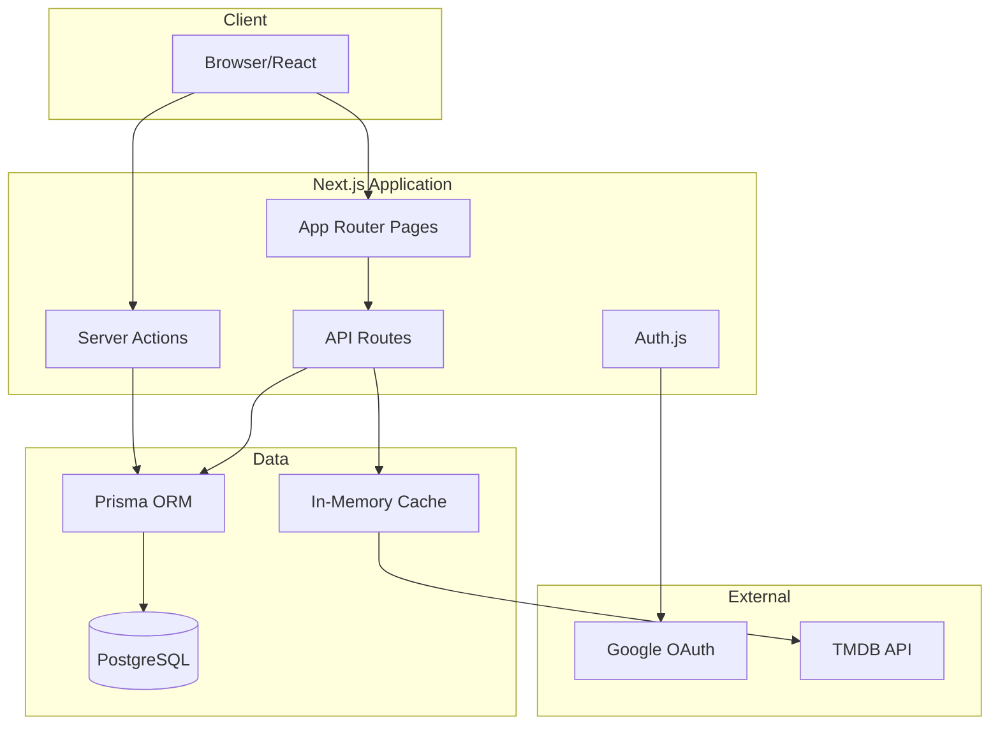
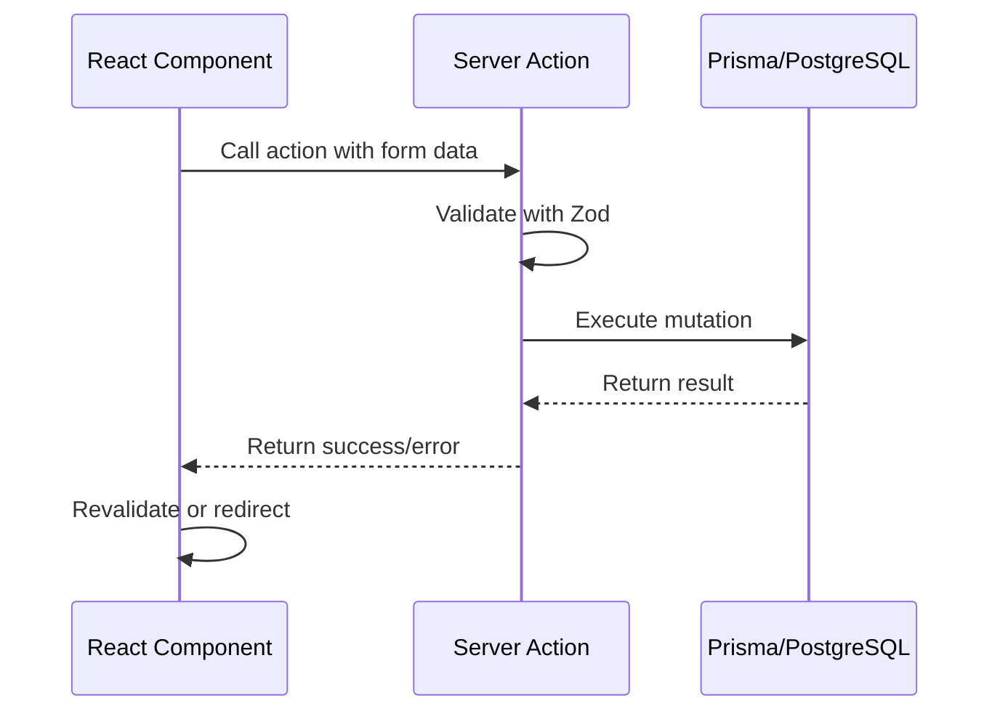
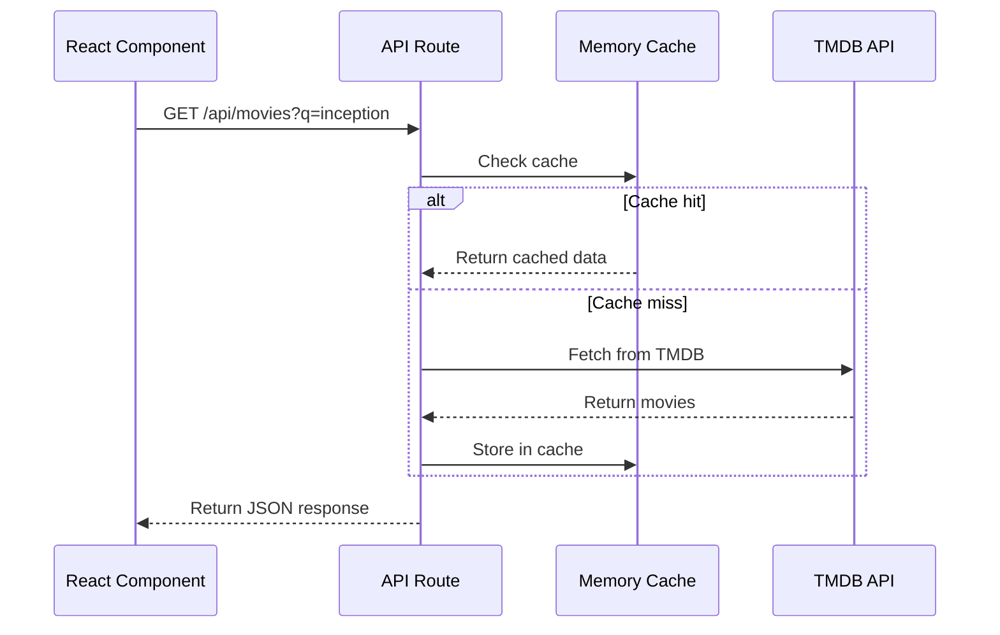
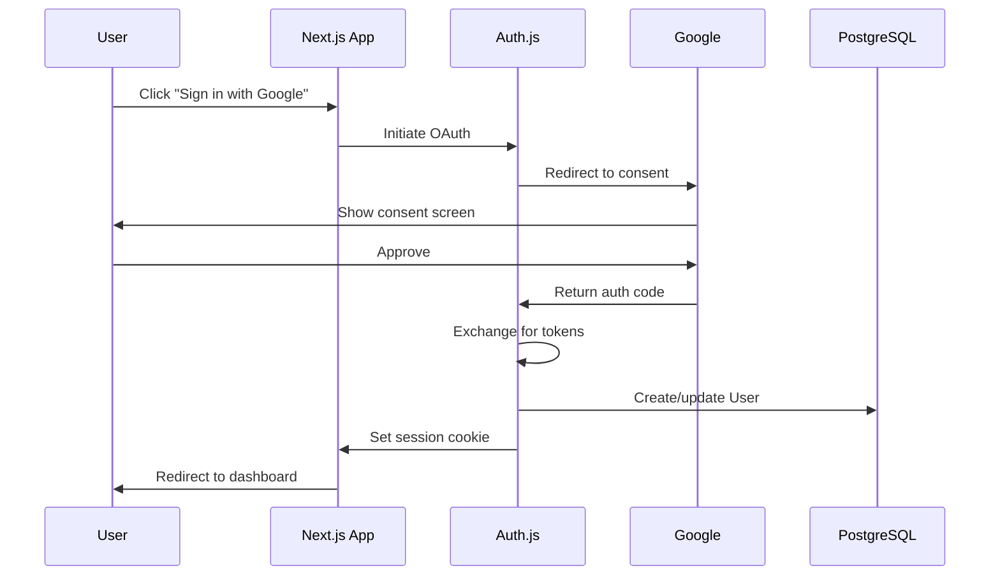

# Architecture

System architecture and design patterns for FelekiDB.

## High-Level Architecture



## Architectural Principles

### 1. Separation of Concerns

| Layer | Responsibility | Location |
|-------|---------------|----------|
| UI | Presentation, user interaction | `src/components/`, `src/app/` |
| Domain Logic | Business rules, validation | `src/lib/` |
| Data Access | Database operations | `src/lib/db/`, Prisma |
| External Services | Third-party APIs | `src/lib/external/` |

### 2. Server-First

Prefer server-side rendering and Server Actions over client-side API calls:
- Less JavaScript shipped to client
- Better SEO
- Simpler data fetching
- Built-in CSRF protection

### 3. Type Safety

TypeScript with strict mode throughout:
- Prisma generates types from schema
- Zod for runtime validation
- Shared types between client/server

## Folder Structure

```
src/
├── app/                    # Next.js App Router
│   ├── (auth)/             # Auth-related pages
│   │   ├── login/
│   │   └── ...
│   ├── (main)/             # Authenticated pages
│   │   ├── dashboard/
│   │   ├── nights/
│   │   └── profile/
│   ├── api/                # API routes
│   │   ├── auth/           # NextAuth routes
│   │   └── movies/         # TMDB proxy
│   ├── layout.tsx          # Root layout
│   └── page.tsx            # Landing page
│
├── components/             # React components
│   ├── ui/                 # Primitives (Button, Input, etc.)
│   ├── features/           # Feature-specific components
│   │   ├── movie-night/
│   │   ├── voting/
│   │   └── rating/
│   └── layout/             # Layout components
│
├── lib/                    # Business logic
│   ├── actions/            # Server Actions
│   │   ├── movie-night.ts
│   │   ├── voting.ts
│   │   └── rating.ts
│   ├── db/                 # Database utilities
│   │   └── queries/        # Reusable queries
│   ├── external/           # External API clients
│   │   └── tmdb.ts
│   ├── auth.ts             # Auth.js config
│   ├── reputation.ts       # Reputation calculations
│   └── utils.ts            # General utilities
│
└── types/                  # TypeScript types
    ├── index.ts
    └── api.ts
```

## Data Flow Patterns

### Pattern 1: Server Action Mutation



**Example: Creating a Movie Night**
```typescript
// src/lib/actions/movie-night.ts
'use server'

export async function createMovieNight(data: CreateMovieNightInput) {
  const session = await auth()
  if (!session?.user) throw new Error('Unauthorized')
  
  const validated = createMovieNightSchema.parse(data)
  
  const night = await prisma.movieNight.create({
    data: {
      ...validated,
      hostId: session.user.id,
      inviteCode: generateInviteCode(),
    }
  })
  
  revalidatePath('/dashboard')
  redirect(`/nights/${night.id}`)
}
```

### Pattern 2: API Route for External Data



## Authentication Flow



## Caching Strategy

### TMDB API Responses
- **Where:** In-memory cache (node-cache or similar)
- **TTL:** 24 hours for movie details, 1 hour for search
- **Key format:** `tmdb:movie:{id}` or `tmdb:search:{query}`

### Static Assets
- Next.js automatic static optimization
- CDN caching for production

### Database Queries
- Prisma query caching (connection pooling)
- Consider Redis for session storage in production

## Error Handling

### Client Errors (4xx)
- Validation errors: Return field-specific messages
- Auth errors: Redirect to login
- Not found: Custom 404 page

### Server Errors (5xx)
- Log full error with context
- Return generic message to client
- Alert monitoring (production)

### External Service Errors
- TMDB down: Show cached results or graceful degradation
- Google OAuth error: Clear error message with retry

## Security Considerations

See [Security](SECURITY.md) for full details.

- All mutations require authentication
- Server Actions have built-in CSRF protection
- Environment variables for secrets
- Prepared statements via Prisma (SQL injection prevention)
- Content Security Policy headers
