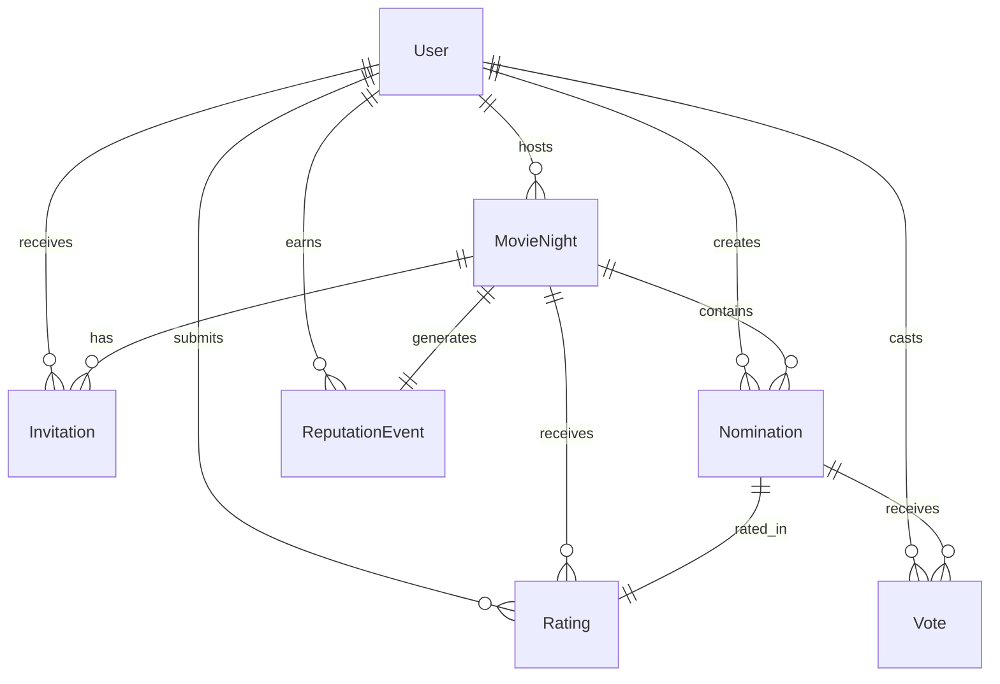

# Database Schema

This document defines the data models for FelekiDB.

## Entity Relationship Diagram



## Models

### User

Stores authenticated user information from Google OAuth.

| Column | Type | Constraints | Description |
|--------|------|-------------|-------------|
| id | String | PK, cuid | Unique identifier |
| email | String | Unique, Not Null | Google email |
| name | String | Not Null | Display name |
| image | String | Nullable | Profile picture URL |
| createdAt | DateTime | Default now | Account creation |
| updatedAt | DateTime | Auto-update | Last modification |

**Relations:**
- Has many `MovieNight` (as host)
- Has many `Invitation`
- Has many `Nomination`
- Has many `Vote`
- Has many `Rating`
- Has many `ReputationEvent`

---

### MovieNight

A movie night event created by a host.

| Column | Type | Constraints | Description |
|--------|------|-------------|-------------|
| id | String | PK, cuid | Unique identifier |
| title | String | Not Null | Event name |
| description | String | Nullable | Optional details |
| scheduledAt | DateTime | Not Null | Date and time |
| location | String | Nullable | Where (text label) |
| inviteCode | String | Unique | Shareable join code |
| votingDeadline | DateTime | Nullable | Auto-close voting |
| status | Enum | Default PLANNING | Current phase |
| hostId | String | FK → User | Event creator |
| winningNominationId | String | FK → Nomination, Nullable | Voted winner |
| createdAt | DateTime | Default now | Creation time |
| updatedAt | DateTime | Auto-update | Last modification |

**Status Enum:**
- `PLANNING` - Invites going out, no voting yet
- `VOTING` - Nominations locked, voting open
- `WATCHING` - Winner selected, event in progress
- `RATING` - Movie watched, collecting ratings
- `COMPLETED` - Ratings finalized

---

### Invitation

Tracks user participation in movie nights.

| Column | Type | Constraints | Description |
|--------|------|-------------|-------------|
| id | String | PK, cuid | Unique identifier |
| movieNightId | String | FK → MovieNight | The event |
| userId | String | FK → User | Invited user |
| status | Enum | Default PENDING | Response status |
| joinedAt | DateTime | Nullable | When accepted |
| createdAt | DateTime | Default now | Invite creation |

**Status Enum:**
- `PENDING` - Not yet responded
- `ACCEPTED` - Will attend
- `DECLINED` - Cannot attend

**Unique Constraint:** (movieNightId, userId)

---

### Nomination

A movie suggested for a movie night.

| Column | Type | Constraints | Description |
|--------|------|-------------|-------------|
| id | String | PK, cuid | Unique identifier |
| movieNightId | String | FK → MovieNight | Target event |
| userId | String | FK → User | Nominator |
| tmdbId | Int | Not Null | TMDB external ID |
| mediaType | Enum | Not Null | movie or tv |
| title | String | Not Null | Movie title |
| posterPath | String | Nullable | TMDB poster path |
| releaseYear | Int | Nullable | Year released |
| pitch | String | Nullable | Why this movie |
| createdAt | DateTime | Default now | When nominated |

**Unique Constraint:** (movieNightId, tmdbId)

---

### Vote

A user's vote for a nomination.

| Column | Type | Constraints | Description |
|--------|------|-------------|-------------|
| id | String | PK, cuid | Unique identifier |
| nominationId | String | FK → Nomination | Voted movie |
| userId | String | FK → User | Voter |
| createdAt | DateTime | Default now | Vote time |
| updatedAt | DateTime | Auto-update | If changed |

**Unique Constraint:** (nominationId.movieNightId, userId) - One vote per night

---

### Rating

Post-watch rating from an attendee.

| Column | Type | Constraints | Description |
|--------|------|-------------|-------------|
| id | String | PK, cuid | Unique identifier |
| movieNightId | String | FK → MovieNight | The event |
| userId | String | FK → User | Rater |
| score | Float | 1.0-5.0 | Rating value |
| comment | String | Nullable | Optional review |
| createdAt | DateTime | Default now | When rated |

**Unique Constraint:** (movieNightId, userId)

---

### ReputationEvent

An event that affects a user's reputation score.

| Column | Type | Constraints | Description |
|--------|------|-------------|-------------|
| id | String | PK, cuid | Unique identifier |
| userId | String | FK → User | Affected user |
| movieNightId | String | FK → MovieNight | Source event |
| nominationId | String | FK → Nomination | Winning nomination |
| averageRating | Float | Not Null | Final average |
| voterCount | Int | Not Null | Number of raters |
| points | Float | Not Null | Calculated impact |
| createdAt | DateTime | Default now | When finalized |

---

## Indexes

```sql
-- Fast lookup for user dashboard
CREATE INDEX idx_invitation_user ON Invitation(userId);
CREATE INDEX idx_movie_night_host ON MovieNight(hostId);
CREATE INDEX idx_movie_night_status ON MovieNight(status);

-- Voting queries
CREATE INDEX idx_nomination_night ON Nomination(movieNightId);
CREATE INDEX idx_vote_nomination ON Vote(nominationId);

-- Reputation queries
CREATE INDEX idx_reputation_user ON ReputationEvent(userId);
CREATE INDEX idx_reputation_created ON ReputationEvent(createdAt);
```

## Prisma Schema Reference

See [prisma/schema.prisma](../prisma/schema.prisma) for the authoritative schema definition.
