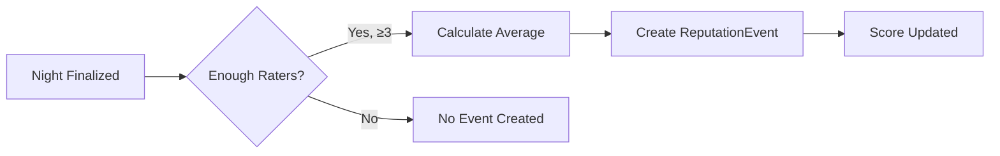

# Reputation System

The reputation system tracks how good users are at picking movies that groups enjoy.

## Core Philosophy

1. **Event-based, not mutable** - Reputation is derived from immutable events, not a single mutable score
2. **Fair** - One amazing pick shouldn't dominate forever; one bad pick isn't permanent
3. **Abuse-resistant** - Gaming the system should be difficult
4. **Transparent** - Users understand how their score is calculated

## How It Works

### Event Creation

When a movie night is finalized (all ratings collected):



### Point Calculation

Each `ReputationEvent` has a `points` value calculated as:

```
points = (averageRating - 3.0) × multiplier × weight
```

Where:
- `averageRating` is 1.0-5.0
- `3.0` is neutral (no impact)
- `multiplier` adjusts for voter count
- `weight` applies time decay

#### Multiplier Table

| Voter Count | Multiplier | Reasoning |
|-------------|------------|-----------|
| 3-4 | 0.8 | Small sample |
| 5-7 | 1.0 | Standard |
| 8-10 | 1.1 | Good turnout |
| 11+ | 1.2 | Large event bonus |

#### Time Decay

Events decay over time to keep reputation current:

```
weight = e^(-age_in_days / 365)
```

- Events from today: weight ≈ 1.0
- Events from 1 year ago: weight ≈ 0.37
- Events from 2 years ago: weight ≈ 0.14

## Reputation Score Calculation

Final reputation is calculated on-the-fly:

```typescript
function calculateReputation(userId: string): number {
  const events = getReputationEvents(userId);
  
  let totalPoints = 0;
  let totalWeight = 0;
  
  for (const event of events) {
    const ageInDays = daysSince(event.createdAt);
    const weight = Math.exp(-ageInDays / 365);
    
    totalPoints += event.points * weight;
    totalWeight += weight;
  }
  
  if (totalWeight === 0) return 50; // Default score
  
  // Normalize to 0-100 scale
  const rawScore = totalPoints / totalWeight;
  return Math.min(100, Math.max(0, 50 + rawScore * 10));
}
```

## Score Display

### Numeric Score
0-100 scale, displayed as integer

### Tier System

| Score Range | Tier | Label |
|-------------|------|-------|
| 90-100 | 🏆 Platinum | "Film Guru" |
| 75-89 | 🥇 Gold | "Great Taste" |
| 60-74 | 🥈 Silver | "Solid Picks" |
| 40-59 | 🥉 Bronze | "Hit or Miss" |
| 0-39 | 📉 Iron | "Needs Improvement" |

## Anti-Abuse Guardrails

### G1: Minimum Voter Threshold

**Rule:** At least 3 unique voters required for reputation impact.

**Why:** Prevents gaming with tiny groups of friends.

### G2: Self-Rating Exclusion

**Rule:** Nominator's own rating doesn't count toward average.

**Why:** Prevents self-boosting.

### G3: Account Age Requirement

**Rule:** Accounts must be 7+ days old to count as voters.

**Why:** Prevents sock puppet accounts.

### G4: Rate Limiting

**Rule:** Max 10 reputation events per user per month.

**Why:** Caps influence from high-volume users.

### G5: Outlier Dampening

**Rule:** Ratings of 1.0 or 5.0 are weighted at 0.8x when calculating average.

**Why:** Reduces impact of spite/favor ratings.

### G6: Score Caps

**Rule:** Single event can change score by max ±5 points.

**Why:** No single movie dominates reputation.

## Implementation

### Database Storage

Events are stored in the `ReputationEvent` table:

```prisma
model ReputationEvent {
  id            String     @id @default(cuid())
  userId        String
  movieNightId  String
  nominationId  String
  averageRating Float
  voterCount    Int
  points        Float      // Pre-calculated at creation
  createdAt     DateTime   @default(now())
  
  user         User       @relation(fields: [userId], references: [id])
  movieNight   MovieNight @relation(fields: [movieNightId], references: [id])
  nomination   Nomination @relation(fields: [nominationId], references: [id])
}
```

### API

```typescript
// Get user's current reputation
GET /api/users/:id/reputation
Response: { score: 72, tier: "Silver", eventCount: 15 }

// Get reputation history
GET /api/users/:id/reputation/history
Response: { events: [...] }
```

### Server Action

```typescript
// Called when movie night is finalized
async function finalizeMovieNight(nightId: string) {
  const night = await getMovieNightWithRatings(nightId);
  
  // Check minimum voters
  if (night.ratings.length < MIN_VOTERS) {
    return; // No reputation event
  }
  
  // Calculate average (excluding nominator)
  const validRatings = night.ratings.filter(
    r => r.userId !== night.winningNomination.userId
  );
  
  const average = calculateDampenedAverage(validRatings);
  const multiplier = getMultiplier(validRatings.length);
  const points = (average - 3.0) * multiplier;
  
  await createReputationEvent({
    userId: night.winningNomination.userId,
    movieNightId: nightId,
    nominationId: night.winningNominationId,
    averageRating: average,
    voterCount: validRatings.length,
    points: Math.max(-5, Math.min(5, points)), // Cap at ±5
  });
}
```

## Leaderboard

Dashboard shows optional leaderboard:
- Top 10 users by reputation
- Filter by friends only
- All-time vs. last 30 days
