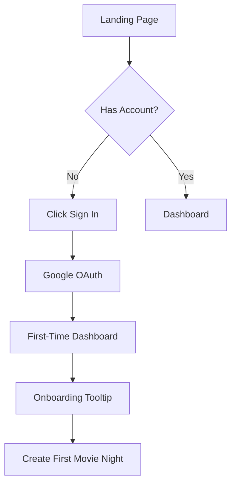
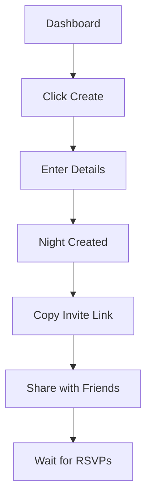
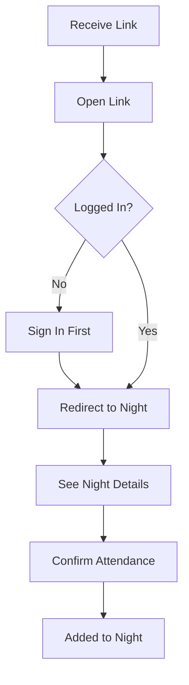
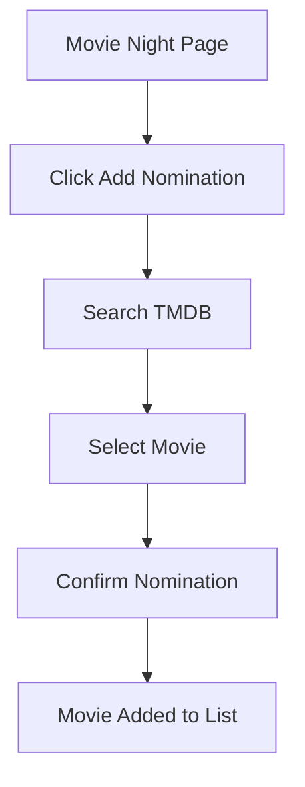
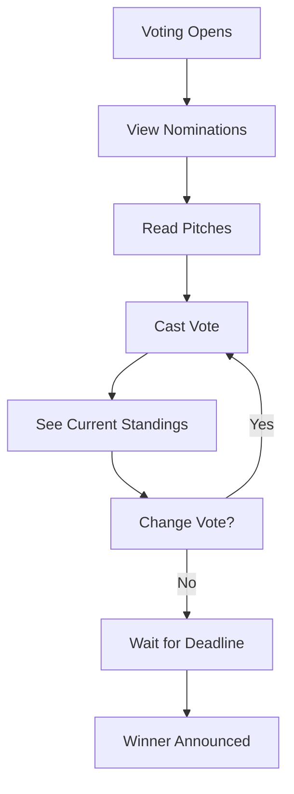
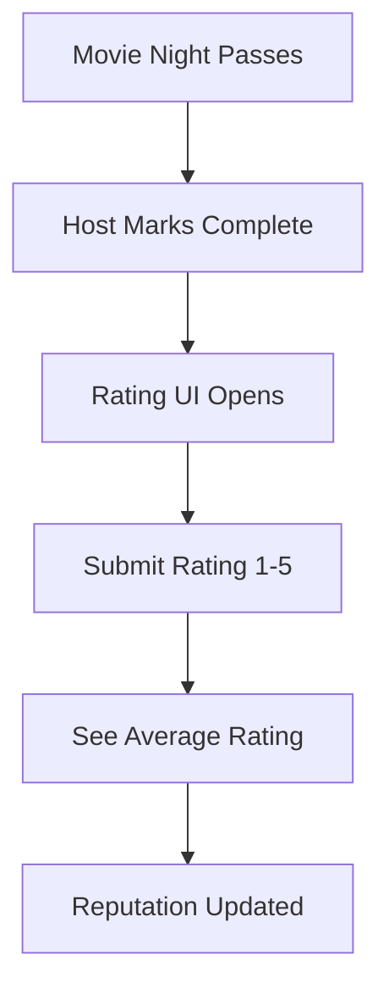
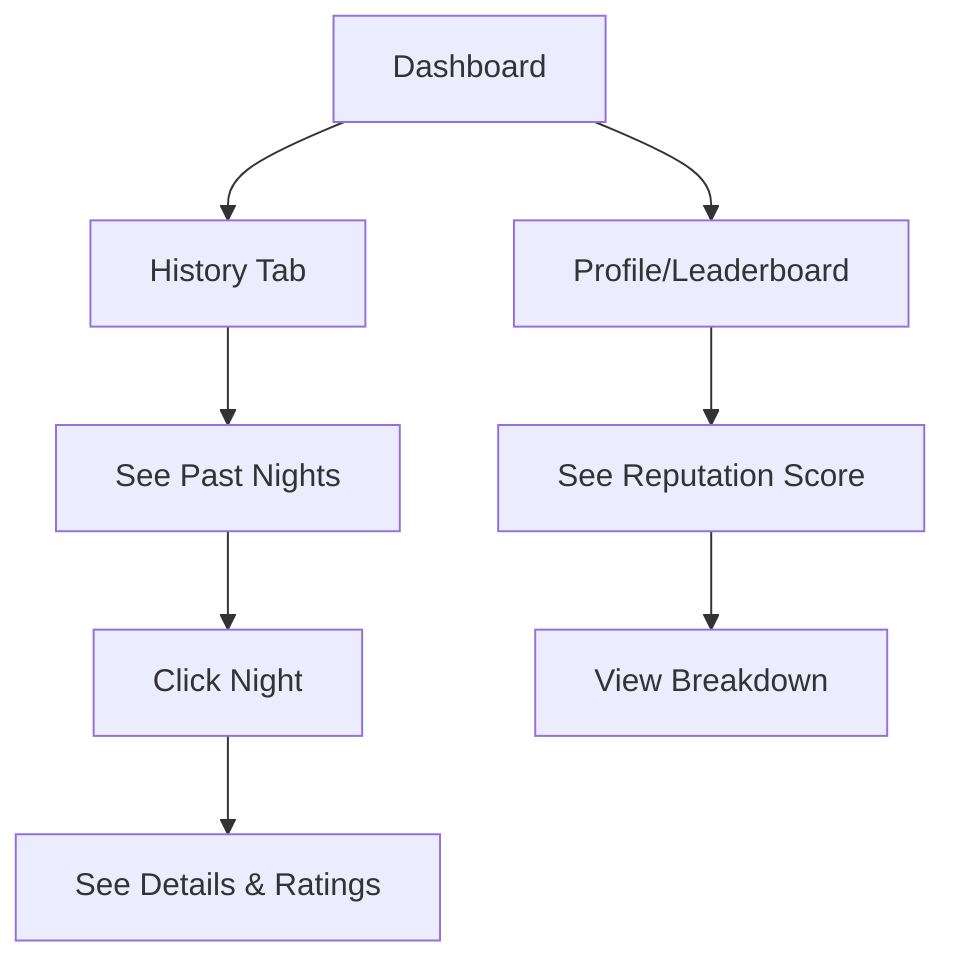

# User Flows

This document describes the primary user journeys through FelekiDB.

## Flow 1: New User Onboarding

### Steps

1. User lands on marketing page
2. Clicks "Sign in with Google"
3. Completes Google OAuth consent
4. Redirected to dashboard (empty state)
5. Sees onboarding prompt to create first movie night
6. Creates movie night → transitions to host flow

---

## Flow 2: Creating a Movie Night (Host)

### Steps

1. Host clicks "Create Movie Night" on dashboard
2. Enters:
   - Title (e.g., "Friday Horror Night")
   - Date and time
   - Location label (e.g., "Sarah's Place" or "Discord")
3. Submits form → night is created
4. Copies shareable invite link
5. Shares link via messaging app
6. Dashboard shows pending night with RSVP count

---

## Flow 3: Joining via Invite Link (Guest)

### Steps

1. Guest receives invite link from host
2. Opens link in browser
3. If not logged in → redirected to auth, then back
4. Sees movie night details (date, location, attendees)
5. Clicks "I'm In" to confirm attendance
6. Now visible in attendee list

---

## Flow 4: Nominating Movies

### Steps

1. From movie night page, click "Nominate a Movie"
2. Search modal opens with TMDB search
3. Type movie/series name
4. Browse results with posters and release years
5. Click movie to nominate
6. Optional: Add a pitch/description
7. Movie appears in nominations list

---

## Flow 5: Voting Phase

### Steps

1. Host opens voting (or it opens automatically)
2. All attendees see nominations with details
3. Each user casts one vote
4. Can see live vote counts (or hide until close)
5. Can change vote before deadline
6. Host closes voting (or auto-closes at deadline)
7. Winner is announced and locked in

---

## Flow 6: Post-Watch Rating

### Steps

1. After the scheduled date, host marks night as "Watched"
2. All attendees see rating prompt
3. Each submits a 1-5 star rating
4. Deadline for ratings (or minimum threshold)
5. Average is calculated and displayed
6. ReputationEvent is created for the nominator
7. Night moves to "Completed" status

---

## Flow 7: Viewing History & Reputation

### Steps

1. From dashboard, switch to History tab
2. Browse past movie nights with dates and ratings
3. Click any night to see full details
4. View who nominated, votes, and final ratings
5. Access leaderboard to compare reputation scores
6. Click user to see their reputation breakdown

---

## Error States

### Failed Authentication
- Show error message with retry option
- Link to support/FAQ

### Invite Link Expired or Invalid
- Clear error page
- Option to request new invite from host

### TMDB Search Fails
- Show cached results if available
- Graceful error with retry button

### Rating Deadline Missed
- Option for host to extend deadline
- Or finalize with current ratings
